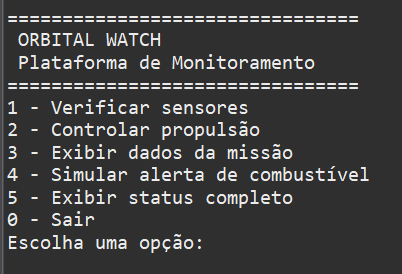
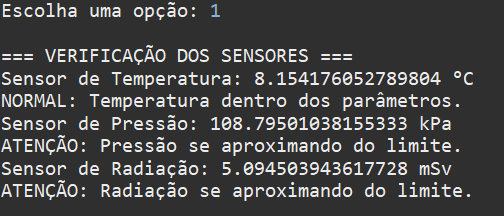
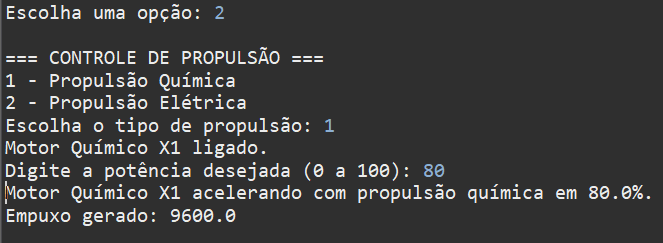
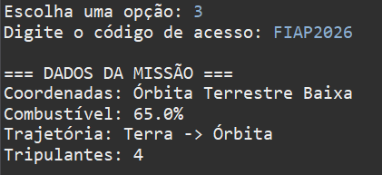
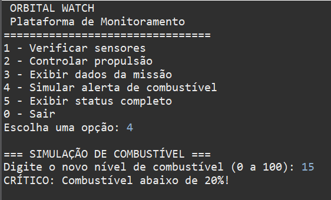
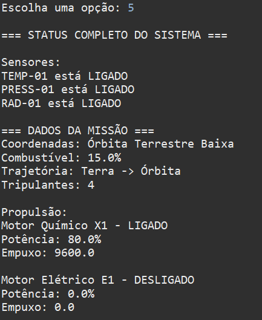
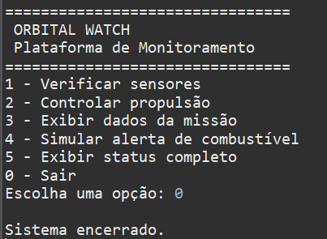

# Orbital Watch

## Global Solution 2026 - Object-Oriented Programming

### Integrantes

- Giovanna Fernandes Pereira - RM: 565434
- João Pedro de Moura Albino - RM: 565323
- Kauê Silva Matheus - RM: 561675

---

## Sobre o Projeto

O **Orbital Watch** é uma plataforma de monitoramento espacial desenvolvida em Java com o objetivo de simular o acompanhamento de sensores, controle de propulsão e gerenciamento de dados de uma missão espacial.

O projeto foi desenvolvido para demonstrar a aplicação dos principais conceitos de Programação Orientada a Objetos (POO) em um cenário alinhado ao tema da Global Solution 2026 – Economia Espacial.

---

## Objetivo

Monitorar componentes espaciais através de sensores inteligentes, emitir alertas automáticos e permitir o gerenciamento das informações da missão por meio de um menu interativo.

---

## Tecnologias Utilizadas

- Java
- Eclipse IDE
- Astah UML
- GitHub

---

## Conceitos de Programação Orientada a Objetos Aplicados

### Encapsulamento

Implementado na classe `DadosMissao`, utilizando atributos privados, getters e setters com validações para proteger informações críticas da missão.

### Herança

Aplicada através das classes:

- `SensorTemperatura`
- `SensorPressao`
- `SensorRadiacao`

que herdam da classe abstrata:

- `ComponenteEspacial`

Também aplicada nas classes:

- `PropulsaoQuimica`
- `PropulsaoEletrica`

que herdam da classe abstrata:

- `SistemaPropulsao`

### Polimorfismo

Implementado através da sobrescrita dos métodos:

- `acelerar()`
- `calcularEmpuxo()`

nas diferentes implementações de propulsão.

### Classe Abstrata

Utilizada nas classes:

- `ComponenteEspacial`
- `SistemaPropulsao`

### Interface

Utilizada através da interface:

- `Sensor`

implementada por todos os sensores do sistema.

---

## Funcionalidades

- Verificação dos sensores
- Monitoramento de temperatura
- Monitoramento de pressão
- Monitoramento de radiação
- Controle de propulsão química
- Controle de propulsão elétrica
- Gerenciamento dos dados da missão
- Simulação de alertas de combustível
- Sistema de alertas
- Menu interativo
- Exibição do status completo do sistema

---

## Sistema de Alertas

O sistema possui três níveis de alerta:

| Nível | Descrição |
|---------|---------|
| ATENÇÃO | Valor próximo do limite operacional |
| ALERTA | Valor acima do limite estabelecido |
| CRÍTICO | Valor muito acima do limite estabelecido |

---

## Evidências de Execução

| Funcionalidade | Evidência |
|---------------|-----------|
| Menu Principal |  |
| Verificação dos Sensores |  |
| Controle de Propulsão |  |
| Dados da Missão |  |
| Simulação de Alerta de Combustível |  |
| Status Completo do Sistema |  |
| Encerramento do Sistema |  |

---

## Diagrama UML

O diagrama UML desenvolvido no Astah encontra-se disponível na pasta:

```text
astah/
```

### Diagrama UML


---

## Estrutura do Projeto

```text
orbital-watch-gs/
│
├── src/
│   └── br/
│       └── com/
│           └── orbitalwatch/
│               ├── main/
│               │   └── SistemaMonitoramento.java
│               │
│               └── model/
│                   ├── ComponenteEspacial.java
│                   ├── Sensor.java
│                   ├── SensorTemperatura.java
│                   ├── SensorPressao.java
│                   ├── SensorRadiacao.java
│                   ├── DadosMissao.java
│                   ├── SistemaPropulsao.java
│                   ├── PropulsaoQuimica.java
│                   └── PropulsaoEletrica.java
│
├── astah/
│   └── ORBITAL WATCH.png
│
├── prints/
│   ├── menu.png
│   ├── sensores.png
│   ├── propulsão.png
│   ├── dadosmissão.png
│   ├── simularalerta.png
│   ├── status.png
│   └── sair.png
│
└── README.md
```

---

## Como Executar

1. Clone o repositório:

```bash
git clone https://github.com/SEU-USUARIO/orbital-watch-gs.git
```

2. Abra o projeto no Eclipse.

3. Execute a classe:

```text
SistemaMonitoramento.java
```

4. Utilize o menu interativo para acessar as funcionalidades do sistema.

---

## Exemplo de Utilização

Após executar o sistema, teste o seguinte fluxo:

```text
1
2
1
80
3
FIAP2026
4
15
5
0
```

Fluxo correspondente:

| Entrada | Ação |
|----------|----------|
| 1 | Verificar sensores |
| 2 | Controlar propulsão |
| 1 | Selecionar propulsão química |
| 80 | Definir potência em 80% |
| 3 | Exibir dados da missão |
| FIAP2026 | Código de acesso da missão |
| 4 | Simular alerta de combustível |
| 15 | Definir combustível em 15% |
| 5 | Exibir status completo |
| 0 | Encerrar sistema |

---

## Resultado

O projeto demonstra a aplicação prática dos principais conceitos de Programação Orientada a Objetos utilizando Java, atendendo aos requisitos propostos pela Global Solution 2026 da disciplina de Object-Oriented Programming.
